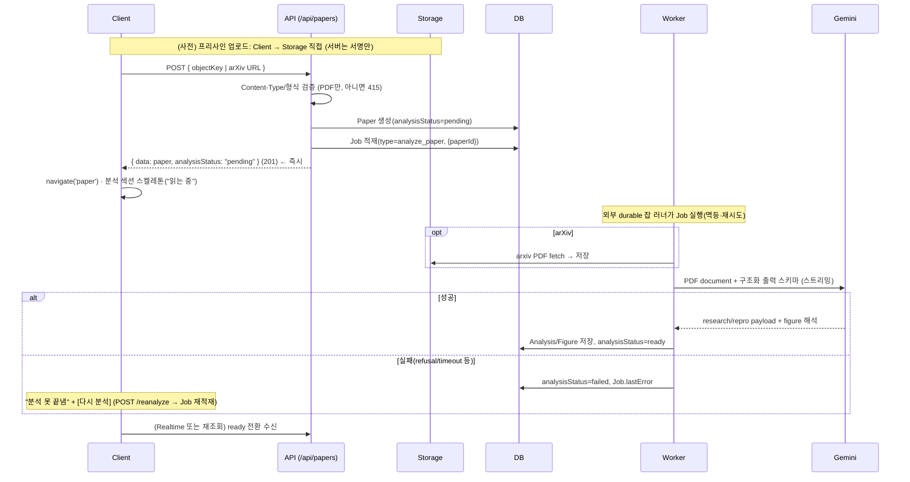
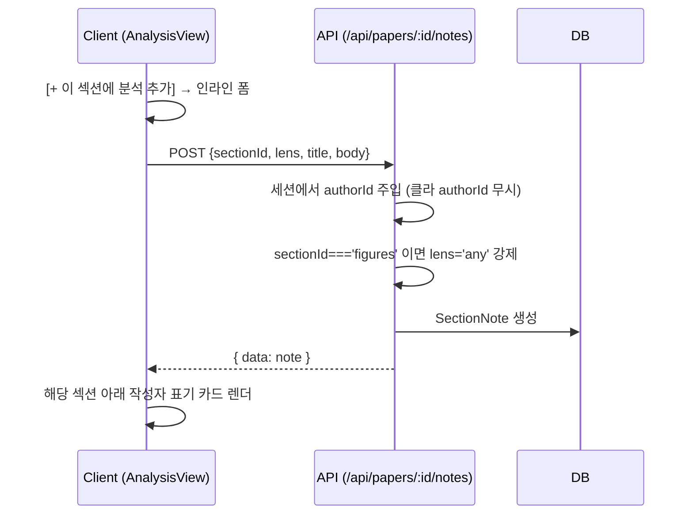
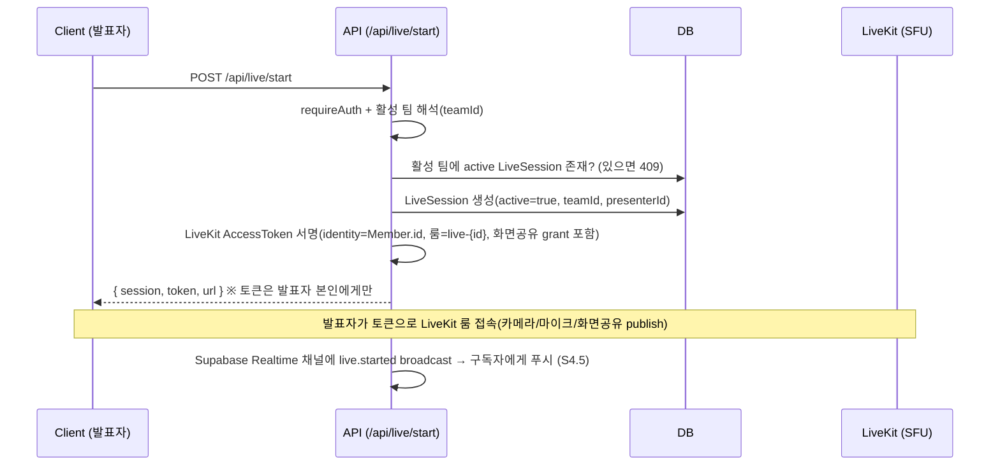
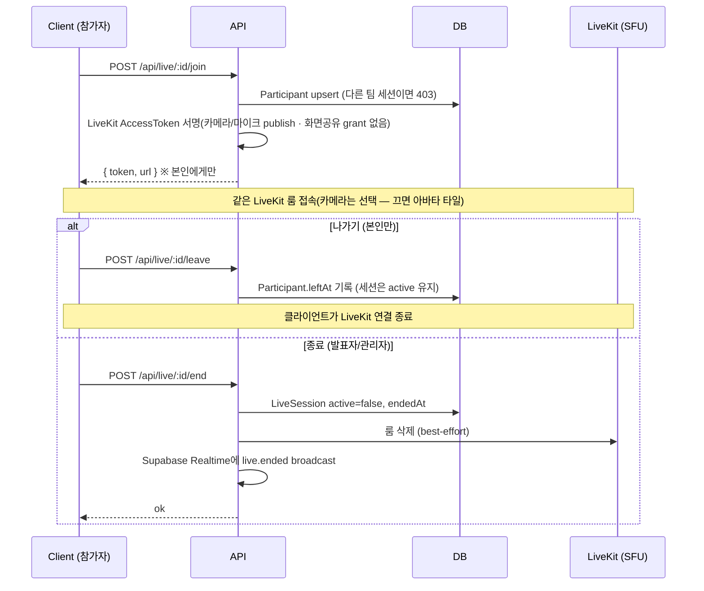
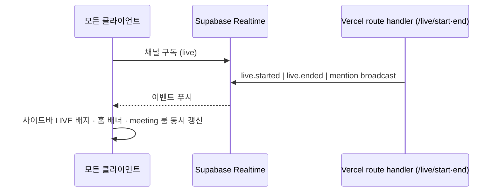
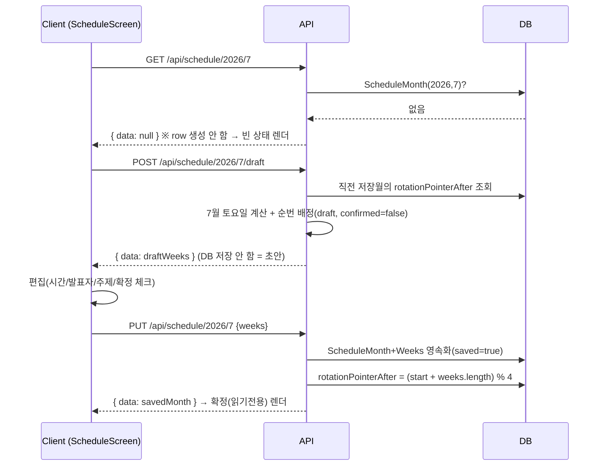
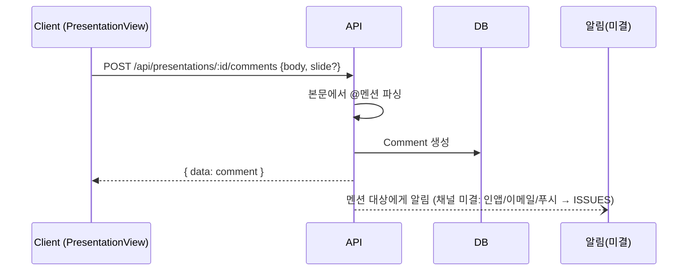
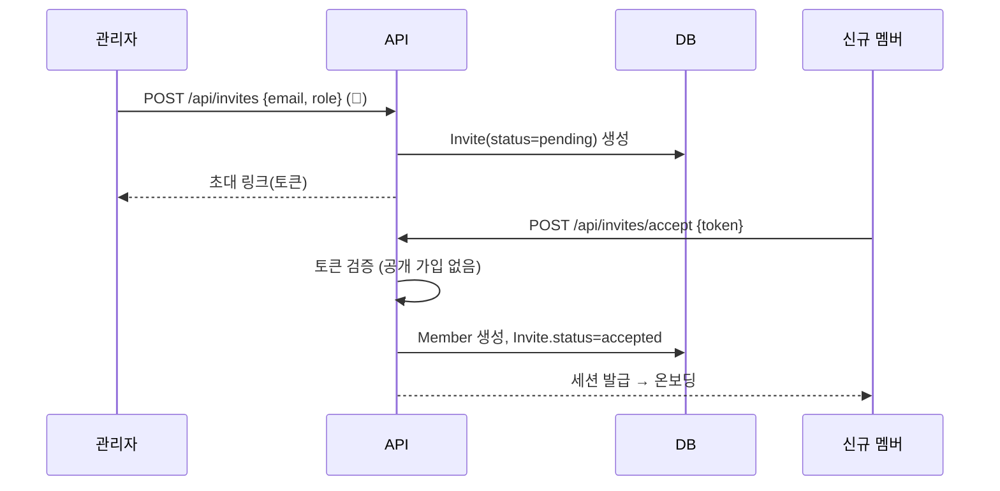

# 시퀀스 다이어그램 (Sequence)

> 엔드포인트는 [`./API.md`](./API.md), 모델은 [`./DB.md`](./DB.md), 화면 전환은 [`../design/SCREEN_FLOW.md`](../design/SCREEN_FLOW.md)를 본다. 이 문서는 주요 동작의 **컴포넌트 간 호출 순서**를 다룬다. 다이어그램은 Mermaid로, 텍스트로도 읽히게 작성한다.

참여자: `Client`(클라이언트 컴포넌트) · `API`(route handler/Server Action) · `DB`(Prisma) · `Storage`(파일) · `LK`(LiveKit SFU, ADR-019).

---

## S1. 논문 업로드 → 분석 생성

참여자에 `W`(외부 durable 잡 러너=Inngest), `CL`(Gemini) 추가.

- ※ **CRITICAL: 분석은 요청 경로가 아니라 워커에서.** Gemini 호출은 분 단위 → HTTP 타임아웃을 넘으므로 API는 잡만 적재하고 즉시 응답한다(ADR-013, [`./ARCHITECTURE.md`](./ARCHITECTURE.md)).
- ※ **업로드 성공 ≠ 분석 성공.** 분석이 실패해도 `Paper`·원문 PDF는 살아 있고 분석만 재시도(UX: [`../design/SCREENS.md`](../design/SCREENS.md)).
- ※ 분석 자동화 수준은 미결 → [`../agent/ISSUES.md`](../agent/ISSUES.md). figure 이미지가 없으면 `imageUrl=null` + 수동 업로드 허용.

## S2. 섹션 노트 추가 (작성자 표기·스코프)

- ※ CRITICAL: 작성자는 **서버가 세션에서 강제**. 위변조 방지(→ [`../security/SECURITY.md`](../security/SECURITY.md)).

## S3. 라이브 시작 (발표자) — LiveKit

- ※ 키(`LIVEKIT_*`) 부재 시 `/start`는 `503`("아직 연결 안 됨", R30) — build/test는 키 없이 통과(R2).

## S4. 라이브 입장(참가자) vs 나가기 vs 종료

- ※ 채팅·반응·손들기·발표자료 페이지 동기화는 **LiveKit 데이터 채널**(휘발·미저장).

## S4.5 라이브 전이 실시간 전파 (Supabase Realtime) — CRITICAL

`live`는 모두에게 즉시 일관돼야 한다(ADR-001). 폴링이 아니라 Realtime 푸시(ADR-014→016).

- 서버리스/다중 리전에서도 성립(인-프로세스 버스 가정 금지). `LiveSession` 변경을 `postgres_changes`로 구독하는 방식도 가능. @멘션 알림 채널은 미결(ISSUES I-5).

## S4.6 녹화 — 미결 (범위 밖)

> ADR-019(LiveKit 전환)로 **Cloudflare 녹화 완료 웹훅 경로는 폐기**했다(`/api/webhooks/cloudflare` 제거). 녹화가 필요하면 LiveKit Egress로 가능하나 이번 범위 밖이다(미결 → [`../agent/ISSUES.md`](../agent/ISSUES.md) I-3). `LiveSession.recordingUrl`은 미사용 레거시 컬럼이다.

- ※ `/leave`는 세션을 끝내지 않는다. `/end`만 전역 종료(ADR-001).

## S5. 스케줄 빈 달 → 초안 → 저장(순번 전진)

- ※ CRITICAL: GET은 절대 월을 만들지 않는다. 초안(POST /draft)도 저장하지 않는다 — PUT만 영속화(ADR-006).

## S6. 발표 자료 회고 댓글 + @멘션

## S7. 멤버 초대 → 합류

